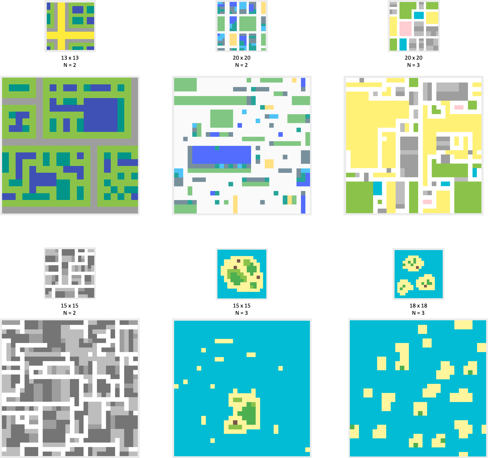
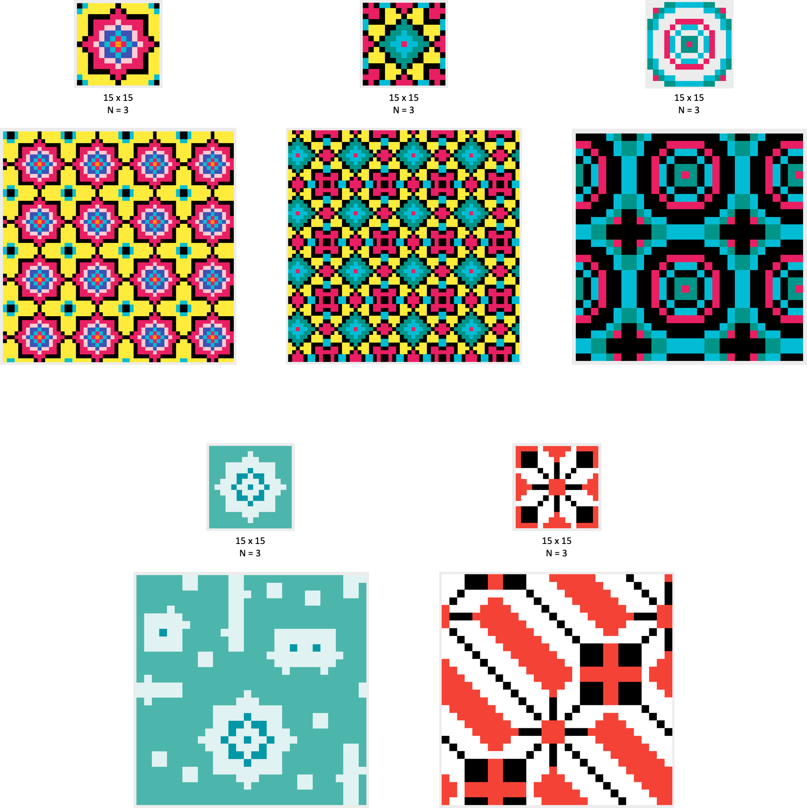

# WFC
WaveFunctionCollapse Project for CMPM 202 W19 - Creation of some artifacts using WFC in Python (using https://github.com/ikarth/wfc_python). Modified samples.xml and sample images added above.   

Sample pixel art images created manually using PixilArt (https://www.pixilart.com/)

# How to Run  
1. Put sample pixel art image (eg. Islands.png) in folder `sample2/`  
2. In samples.xml, add a line indicating tilesize for sampe image: `<overlapping name="Islands" N="3" periodic="True"/>`  
3. Instantiate an OverlappingModel using the sample image: `a_model = OverlappingModel(WIDTH, HEIGTH, SAMPLE_NAME, N, PERIODIC_IN, PERIODIC_OUT, SYMMETRY, GROUND)` in model.py  
4. Run on terminal: `python3.6 model.py`  

In progress output images are saved to the same directory with code. NxN samples are taken from the input image as inferred rules.  

Note: Python code is computationally slow. Ouput images are between 30x30 pixels and 60x60 pixels.  

### Flat Maps and Terrains:  
Map structure is better preserved with larger tile size (N=3), especially in images with clear boundaries around certain objects.  
  
  
  
  
  
### Persian Patterns: 
Images with a lot more details ended up being tiled entirely due to there being fewer 'legal' neighbors per tile. Simpler patterns lead to more interesting generated artifacts.  
  
  

